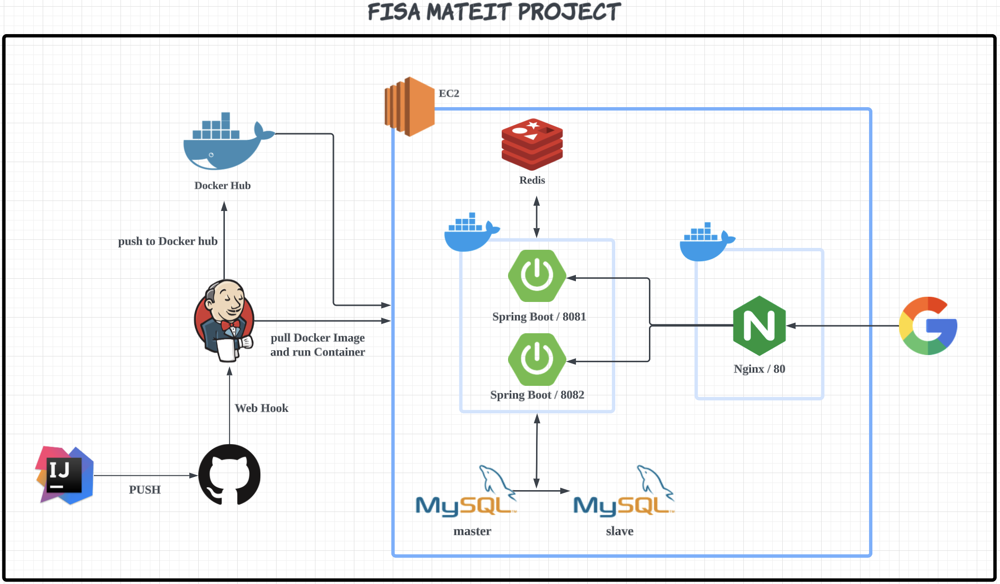
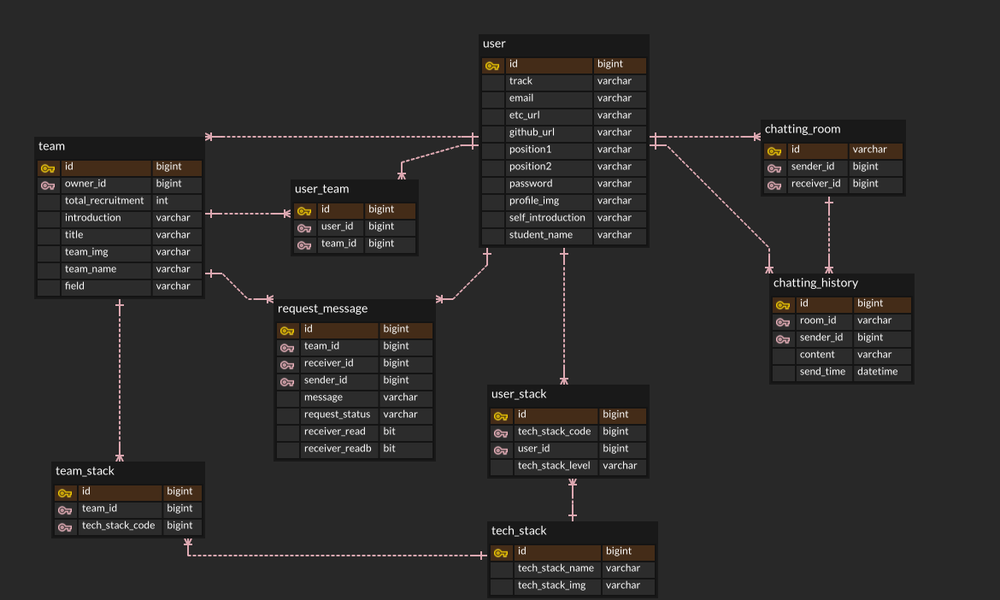

## 🧑🏻‍💻 MATEIT 소개합니다.

MATE-IT 서비스는 `교육장 내에서 프로젝트 팀 빌딩을 위한 서비스`입니다.  
자신과 비슷한 코드적 성향과 개발 가치관이 유사한 `"코드메이트"`를 찾아주는 것을 목표로 합니다.

### 🤛🏻 Service Vision

> `서비스 목표` : 교육생들의 소통 창구를 더불어 좋은 결과물을 만들기 위한 팀 빌딩을 목표로한다.

## ⚙️ 기술을 소개합니다

### System Architecture

### ERD

## 👩‍👩‍👧‍👧 팀원 소개

|                                               엄수혁                                                |                                            이상혁                                             |                                           이다인                                           |
|:------------------------------------------------------------------------------------------------:|:------------------------------------------------------------------------------------------:|:---------------------------------------------------------------------------------------:|
|  |  |  
|                                            **Server**                                            |                                         **Server**                                         |                                       **Server**                                        |
